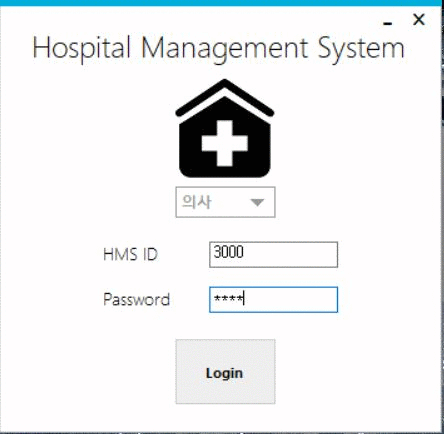
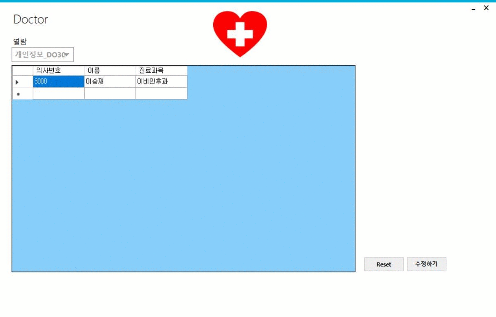
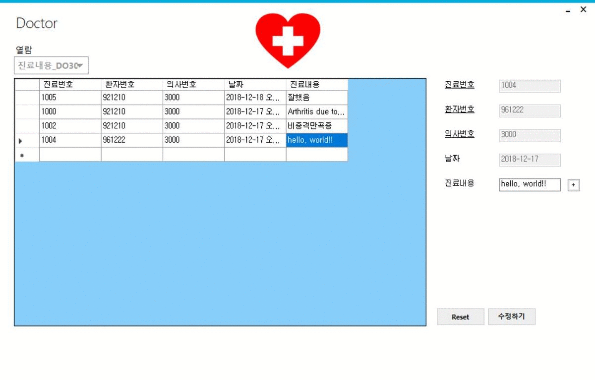

# Hospital member management system - HMS
It's a hospital member management program using a database.  
Used tech stack : <b>C#, Oracle 11g</b>  
This project was written in Visual Studio 2017.  
[HMS.zip](HMS.zip)  

 
# Play video

# Execution screen
<b>Example member : doctor</b>   

# Description
#Doctor  
What you can handle : information about yourself (read),  
care-details (read / write), doctor-opinion (read / write)  

#Nurse  
What you can handle : information about yourself (read),  
care-details (registration), medical-chart (registration), the patient in charge (read)  

#Patient  
What you can handle : information about yourself (read),  
your own charts (read)  

#Administrator  
Doctors, nurses, patient (registration / update),  
table creation and appropriate authorization (all rights)  

.* Additional information for understanding table relationships :  
[SQL DB 병원관리시스템.txt](https://github.com/JAlthea/Hospital-member-management-system/tree/master/HMS%20Project/important%20files)
